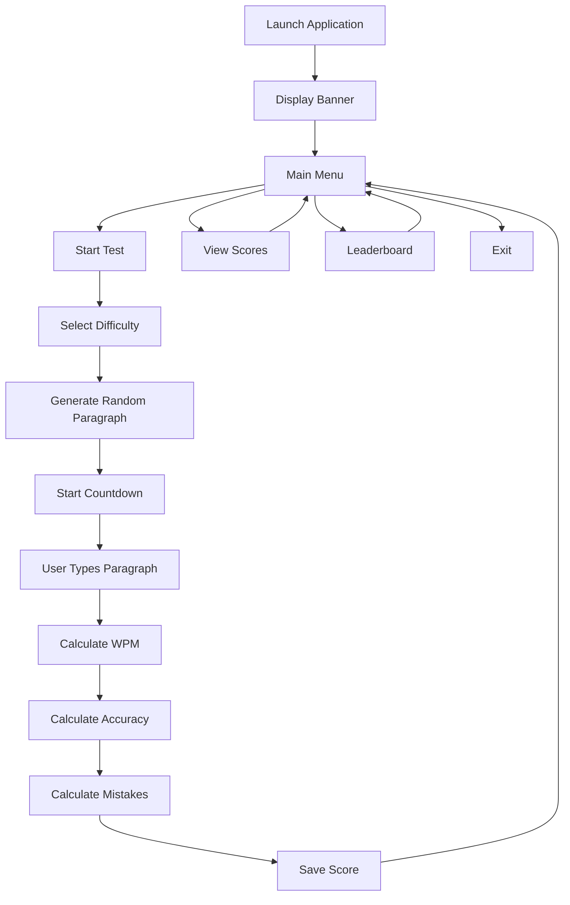

# Typing Speed Tester Pro

<div align="center">


A terminal-based Typing Speed Tester built with Java.

Measure typing speed, accuracy, mistakes, maintain score history, and track performance through a leaderboard system.

</div>

---

## Features

- Random Paragraph Generation
- Typing Speed Calculation (WPM)
- Accuracy Percentage
- Mistake Detection
- Username System
- Score History
- Leaderboard
- Difficulty Levels
- Colored Terminal UI
- JColor Integration
- JFiglet ASCII Banner
- File Handling

---

## Tech Stack

<div align="center">


</div>

### Libraries Used

| Library | Purpose |
|----------|----------|
| JColor | Terminal Colors |
| JFiglet | ASCII Art Banner |
| Java IO | File Handling |
| Java Collections | Leaderboard |
| Java Time API | Speed Calculation |

---

## Project Structure

```text
Typing-Speed-Tester/
│
├── src/
│   ├── TypingSpeedTester.java
│   ├── Colors.java
│   └── ScoreManager.java
│
├── scores.txt
├── README.md
└── pom.xml
```

---

## Application Flow



---

## Difficulty Levels

| Level | Description |
|---------|------------|
| Easy | Short Sentences |
| Medium | Medium-Length Paragraphs |
| Hard | Long Technical Paragraphs |

---

## WPM Formula

```text
WPM = Total Words Typed / Time In Minutes
```

---

## Accuracy Formula

```text
Accuracy = Correct Characters / Total Characters × 100
```

---

## Performance Levels

| WPM Range | Level |
|------------|---------|
| 70+ | Expert |
| 50 - 69 | Advanced |
| 30 - 49 | Intermediate |
| Below 30 | Beginner |

---

## Score Storage

Scores are stored locally in:

```text
scores.txt
```

Example:

```text
Chhatrapati,68.45,97.80
Rahul,55.20,95.10
Aman,42.70,90.50
```

---

## Installation

### Clone Repository

```bash
git clone https://github.com/yourusername/Typing-Speed-Tester.git
```

### Navigate to Project

```bash
cd Typing-Speed-Tester
```

### Compile

```bash
javac *.java
```

### Run

```bash
java TypingSpeedTester
```

---

## Sample Output

```text
====================================================
                 SPEED TESTER PRO
====================================================

WPM        : 68.5
Accuracy   : 97.8%
Mistakes   : 2
Time Taken : 14.2 sec
```

---

## Future Improvements

- User Profiles
- Statistics Dashboard
- Database Integration
- Online Leaderboard
- Multiplayer Mode
- Theme Customization
- Sound Effects

---

## Author

Chhatrapati Sahu

B.Tech Computer Science and Engineering

Java Developer | DSA Enthusiast | Open Source Learner
